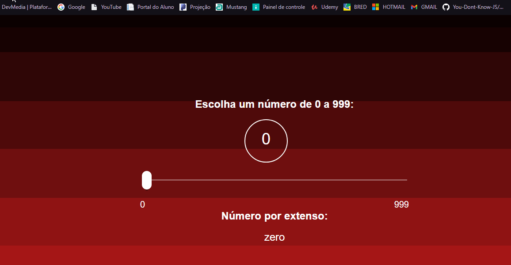
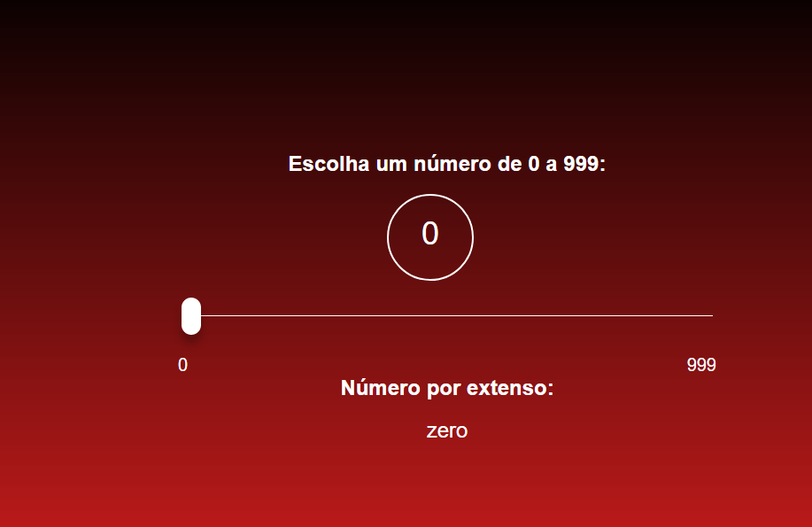

  <a href="#-tecnologias">Tecnologias</a>&nbsp;&nbsp;&nbsp;|&nbsp;&nbsp;&nbsp;
  <a href="#-projeto">Projeto</a>&nbsp;&nbsp;&nbsp;|&nbsp;&nbsp;&nbsp;
  <a href="#-Objetivo">Objetivo</a>&nbsp;&nbsp;&nbsp;|&nbsp;&nbsp;&nbsp;
  <a href="#-how-to-test">How to test?</a>&nbsp;&nbsp;&nbsp;|&nbsp;&nbsp;&nbsp;

 

## 🚀 Tecnologias

Esse projeto foi desenvolvido com as seguintes tecnologias:

- HTML
- CSS
- JavaScript

## 💻 Projeto

O projeto cria uma aplicação que deve,
a partir de um número definido pelo usuário (entre 0 e 999, inclusive), mostrar como
é a descrição do número, ou seja, o número por extenso.

## 🔖 Objetivo

Esse projeto foi realizado com o objetivo de colocar em prática o que aprendi no Modulo 1 - Fundamentos - Desenvolvedor(a) Full Stack, do Bootcamp Dev Fullstack do IGTI- Instituto de Gestão e Tecnologia da Informação.

## 💻 How to test?

 

Basta você clonar o repositório e abrir o index.html em algum browser que o projeto já poderá ser testado.
 

 A qualidade real de imagem do Projeto:

<h3><strong>Feito por Bryan.</strong><h3>

